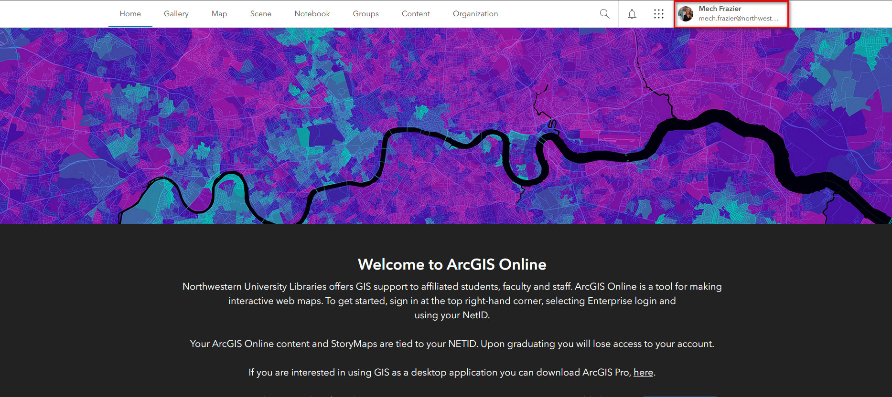
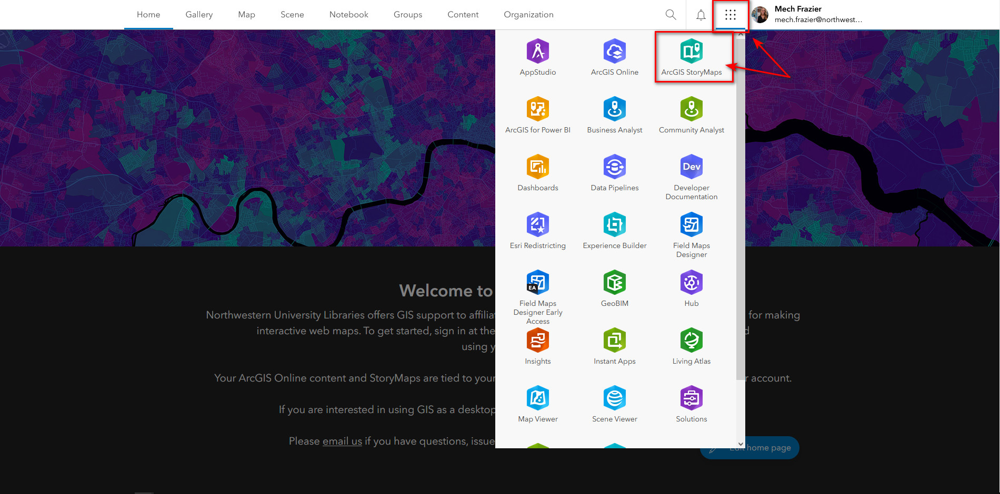
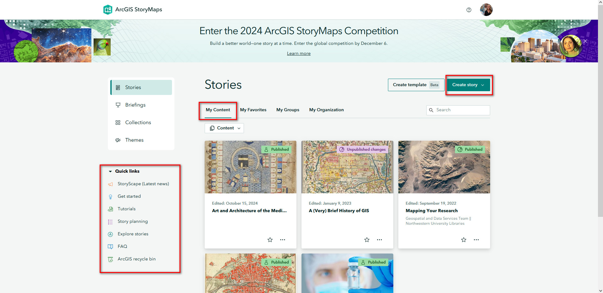

Step 1
{: .label .label-step}
Sign up for Northwestern ArcOnline account using your NetID and password here: [https://northwestern.maps.arcgis.com/home/index.html](https://northwestern.maps.arcgis.com/home/index.html)
   - Make sure you're signed in (you should see your name at the top right corner:
   - 
{: .step}
   
Step 2
{: .label .label-step}
Click on the the waffle-looking icon next to your name on the home page. Find and select the "ArcGIS StoryMaps" application. 
   - 
{: .step}

Step 3
{: .label .label-step}
This is the home page of ArcGIS Story Maps. Let's familiarize ourselves with the layout.
    - 
{: .step}
